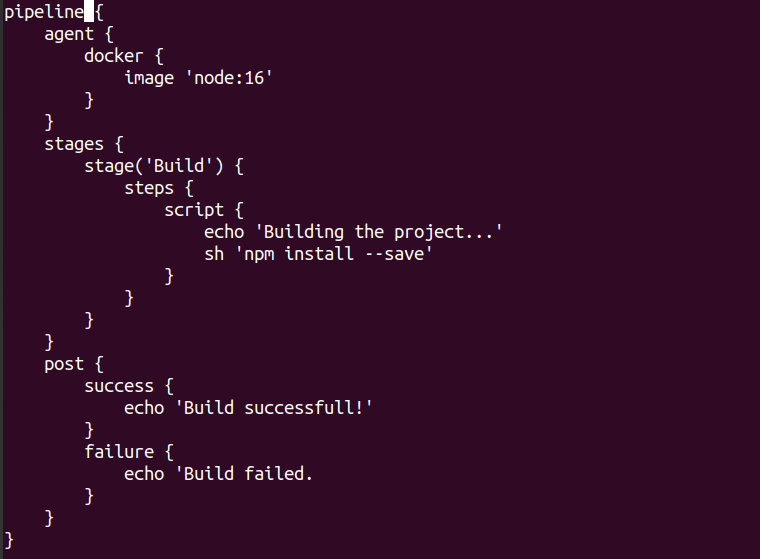

# Task3 Jenkinsfile Creation

## Create Jenkinsfile which would be used for Pipeline creation.

- Jenkinsfile contains the definition of the pipeline that can be used
  for CI/CD

- It is written in Groovy DSL and contains the stages and steps required
  for CI/CD

- Jenkinsfile declarative syntax includes pipeline at the top-level
  followed by agent (node where to execute) and stages (pipeline stages
  like build).

Figure 12 Copying the forked repository to be cloned into local machine
to create Jenkinsfile

Figure 13 Cloning in the Current Working Directory in the local machine

## Commit and Push Jenkinsfile

Figure 14 Jenkinsfile content

Figure 15 Add and commit the changes to be pushed into forked
repository.

Figure 16 Pushing the committed changes into forked repository.

*Figure 17 Jenkinsfile in the GitHub*
